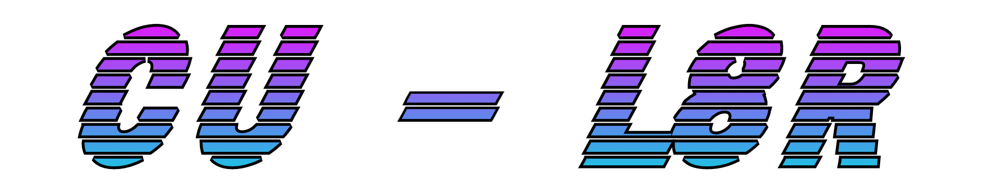
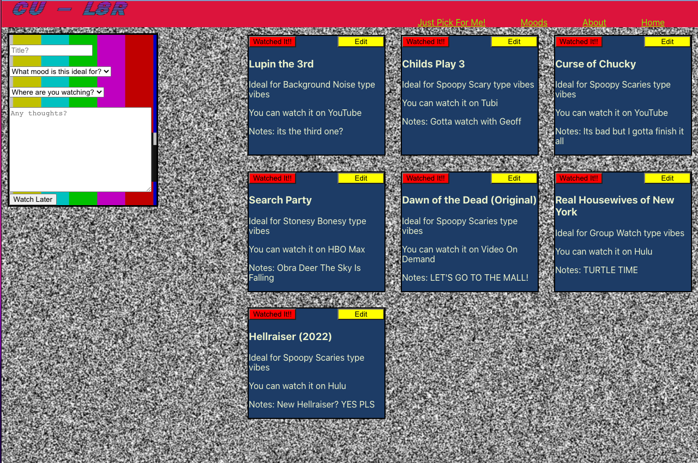

### **CU-L8R**
### Andres 'Dre' Bolivar | [07/24/2022]
### [Github](http://www.github.com/drebolivar) | [Portfolio](http://drebolivar.github.io/portfolio) | [LinkedIn](http://www.linkedin.com/in/drebolivar) | [Instagram](http://www.instagram.com/dredose) | [Deployed](https://cul8r.netlify.app/)
---
## **_Description:_**

CU-L8R ("see you later" or "queue later") is a localized watchlist for households that have had many a
difficult movie night trying to figure out what to watch.

---
## **_Technologies Used_**

- _MERN_
  - Mongoose
  - Express
  - ReactJS
  - NodeJS

---
## **_Stretch Goals_**
- [ ] 3rd-party API for titles/images/descriptions
- [ ] Profiles/Login
- [ ] a "Bookmark" option to edit where you may have left off on the movie/series
- [ ] Randomizer

## **_Screenshots:_**
